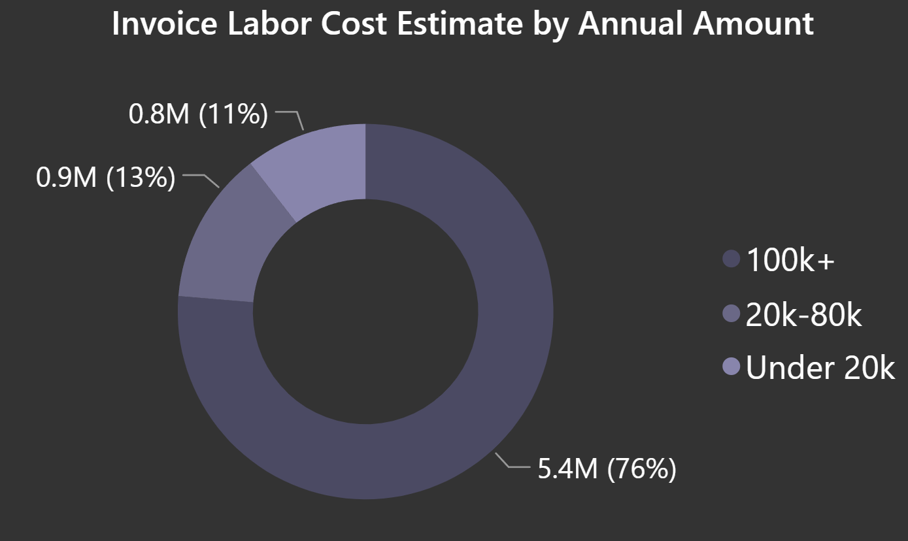
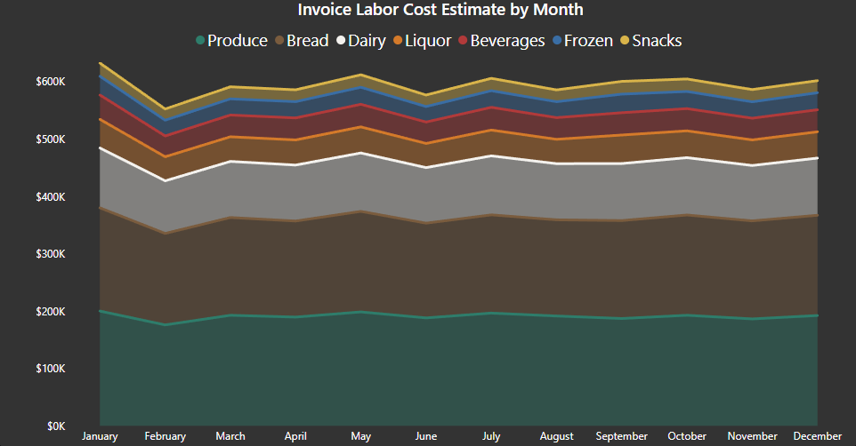
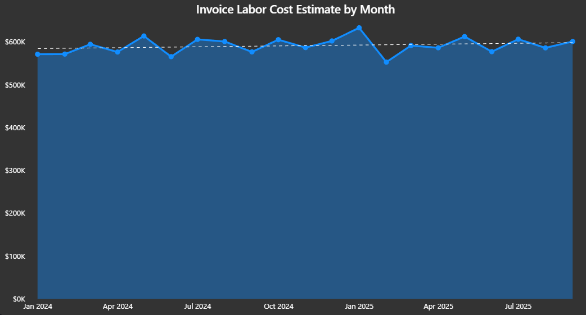
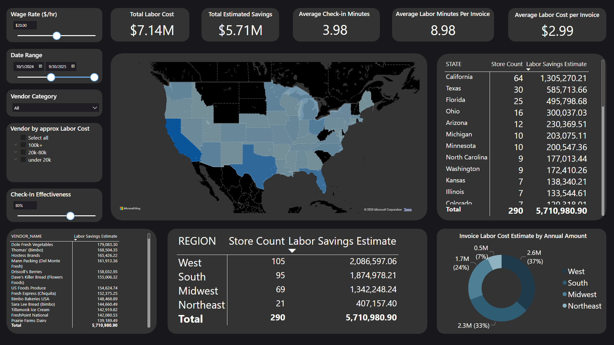

# Retail Invoice Analysis

## Table of Contents
- [Scenario](#scenario)
- [Executive Summary](#executive-summary)
- [Data Structure](#data-structure)
- [Deep-Dive Analysis](#key-operational-metrics)
- [Implementation Strategy](#implementation-strategy-options)
- [Scenario Modeling & Controls](#scenario-modeling--controls)
- [Data Schema (leave page)](data/data_structure.md)

Implementation Strategy Options

## Project Context

- **Organization Type:** National grocery retailer
- **Store Count:** 290 locations
- **Time Period Analyzed:** Prior 12 months
- **Primary Audience:** Operations leadership
- **Secondary Stakeholders:** Finance, Vendor Management, IT Transformation
- **Objective:** Quantify labor savings opportunity from automated invoice receiving

## Scenario
A national grocery retailer with 290 stores is implementing a new inventory management system that applies ML/AI interfaces to support more effective purchasing and inventory management. It seamlessly integrates with the current corporate ERP, Inventory management, and SCM systems, and is estimated to save over $45 million annually by anticipating and preventing product shrinkage, as well as making auto pricing adjustments to meet dynamic market conditions. The vendor providing the system is offering an additional automated receiving system, promising to automate inventory check-ins by both local and national vendors. It requires vendor agreement to use, but it can eliminate the need for a reciever to be present, as 80% of transactions can be performed autonomously. This system also eliminates the need for physical invoices to be manually photocopied, which saves substantial labor costs. 

<table>
  <tr>
    <td align="center">
      
        
      <strong>Current Process</strong>
    </td>
    <td align="center">
      
       
      <strong>Proposed Process</strong>
    </td>
  </tr>
</table>

## Business Questions

### 1.) How much would be saved, in labor cost, if recieving at retail stores was automated for all vendors?

### 2.) Given the system is adopted, which vendors and regions are priority to accept the new recieving system?

### 3.) Executives speculate at least $2M in annual cost savings are needed to justify implementation, which senerios of vendors accepting this new system would be needed? 

#### Assumptions:
> - Every store utalizes the technology, and every vendor adopts and accepts its use
> - Labor costs $20 an hour on average, 5 minutes of overhead productivity are lost while photocopying invoices on average
> - 80% effective at making the process autonomous, and 20% will have to be applied manually and would take the same amount of time as the old system to validate, effectively reducing savings by 20% compared to perfect conditions

#### Caveats & Considerations
> - Vendor participation is voluntary
> - Automation effectiveness may vary by vendor and delivery type
> - Labor rates vary by region but are modeled at an average rate
> - Invoice complexity and exception handling are not explicitly modeled

---

## Executive Summary

Based on invoice activity over the most recent 12-month period, total estimated labor cost associated with manual invoice check-in is \$7.14M annually across 290 stores. Under the assumed conditions—an average labor rate of \$20/hr and 80% automation effectiveness—the estimated achievable labor savings total \$5.71M annually, exceeding the $2M executive justification threshold by a wide margin.

These findings indicate invoice processing is a meaningful and repeatable operational cost center suitable for automation.

--- 

## Data Structure

- Invoice-level fact data
- Vendor and vendor-category dimensions
- Date dimension for time-based aggregation
- See [Data Schema](data/data_structure.md) for technical details

--- 

## Analysis Deep Dive

## Key Operational Metrics

### Invoice Processing Efficiency
- **Average Check-in Time:** 3.98 minutes  
- **Invoice Process Overhead:** 5 minutes
- **Average Total Labor Time per Invoice:** 8.98 minutes  
- **Average Labor Cost per Invoice:** $2.99  

Check-in activities alone account for approximately **44% of total invoice labor time**, reinforcing the value of automation even when partial manual intervention remains necessary.

## Vendor Cost Concentration

### Annual Labor Cost by Vendor
- **Total vendor invoice labor cost:** $7.14M
- **Vendors > \$100K:** 76% ($5.4M)
- **\$20K–\$80K vendors:** 13% ($0.9M)
- **< \$20K vendors:** 11% ($0.8M)

Labor cost is highly concentrated among a small subset of vendors, making targeted adoption strategies viable and impactful.

## Vendor Category Insights

### Labor Cost Distribution
- **Produce:** $2.3M (32%)
- **Bread:** $2.0M (29%)
- **Dairy:** $1.2M (17%)
- **Liquor, Beverages, Frozen, Snacks:** $1.7M combined (22%)

Produce and bread alone account for over **60% of total labor cost**, supporting category-led rollout strategies.

## Regional Analysis

Labor savings potential is concentrated in regions with the highest store density.

- **West:** 105 stores, ~\$2.09M in estimated annual labor savings  
- **South:** 95 stores, ~\$1.87M 
- **Midwest:** 69 stores, ~\$1.34M  
- **Northeast:** 21 stores, ~\$0.41M   

At the state level, savings are most concentrated in:
- **California:** 64 stores, ~\$1.31M  
- **Texas:** 30 stores, ~\$0.59M  
- **Florida:** 25 stores, ~\$0.50M  

These three states alone represent **119 stores (41% of 290 total stores) and nearly \$2.4M in annual labor savings**, making them strong candidates for early regional or state-level rollout pilots.

### Regional Implications
- The West and South regions together account for the majority (70%) of estimated labor savings
- Savings scale primarily with store count rather than regional process differences
- Prioritizing rollout in these regions and states accelerates value realization while minimizing operational risk

## Temporal Trends

Invoice labor costs remain **stable month-over-month** with no significant seasonality, supporting predictable annualized savings projections and reduced implementation risk.

## Adoption Threshold Analysis

- **Top 32 vendors:** \$110K–\$190K potential annual labor savings each
- **14–17 vendors adopted nationally** exceed the $2M savings threshold
- Full national adoption materially exceeds required ROI

This supports phased vendor rollout strategies.

## Operational Complexity Considerations

### Check-in Time by Delivery Size
- **Large deliveries:** ~4.3 minutes
- **Medium deliveries:** ~3.9 minutes
- **Small deliveries:** ~3.2 minutes

Automation benefits apply broadly across delivery sizes.

## Implications for Operations Leadership

- Invoice processing is a recurring, structural labor cost
- Savings are predictable and concentrated
- Partial adoption yields strong returns
- Regional or category-led rollouts accelerate value realization
- Automation reduces non-value-added labor without disrupting store operations

---

## Implementation Strategy Options

Multiple implementation paths exist for automated receiving. Each carries different operational, technical, and vendor-management implications. The optimal approach may vary by vendor profile, region, and distributor operating model.

### Option 1: National Vendor Agreement–Led Rollout

A single agreement with large, national vendors enables the fastest path to material savings.

#### Optimal For
- Vendors operate consistently across regions and states
- Centralized vendor IT and logistics systems
- High invoice volume across many stores

**Advantages**
- Maximizes savings quickly
- Simplifies governance and change management
- Reduces regional fragmentation

**Considerations**
- Vendors may need to invest in compatible IT or process changes
- Adoption timelines are outside direct retailer control
- Not all national vendors may be willing or able to comply

### Option 2: Regional or State-Based Rollout

Implementation is prioritized in high-density regions or states with the greatest savings potential.

#### Optimal For
- Regional distributors operate semi-independently
- Vendor practices differ materially by geography
- Pilot-and-expand strategy is preferred

**Advantages**
- Faster localized deployment
- Lower upfront vendor coordination risk
- Enables operational learning before national scale

**Considerations**
- Slower realization of total enterprise savings
- Requires region-specific change management
- May introduce temporary process inconsistency

### Option 3: Hybrid Strategy (Vendor Tier + Geography)

Combines national vendor adoption with regional pilots for smaller or regional vendors.

#### Optimal For
- Vendor base is highly fragmented
- Large vendors deliver most volume, smaller vendors vary by region
- Operations seeks flexibility without sacrificing scale

**Advantages**
- Balances speed and risk
- Captures majority of savings early
- Maintains optionality for phased expansion

**Considerations**
- Increased coordination complexity
- Requires clear governance and rollout sequencing

### Key Assumptions & Operational Dependencies

The modeled savings assume idealized conditions. Real-world execution will depend on several external and internal factors:

- Vendor IT readiness: Some vendors may need system upgrades or integration work
- Distributor variability: Regional distributors may follow different receiving or invoicing practices
- Process standardization: Degree of consistency in delivery, documentation, and exception handling
- Change adoption: Store-level compliance and training effectiveness
- Automation effectiveness: Actual autonomy rates may vary by vendor and delivery type

## Scenario Modeling & Controls

The BI dashboard supports real-time scenario analysis through:
- Adjustable wage rate assumptions
- Variable date ranges
- Vendor category and cost-tier filtering
- Automation effectiveness slider

These controls allow stakeholders to validate savings under conservative or aggressive assumptions.

### Scenerio Analysis Dashboard

### Deep-Dive Analysis View

### Regional Analysis View
